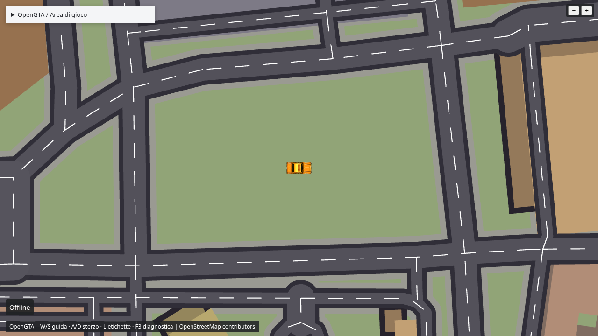

# OpenGTA Web

[](https://opensource.org/licenses/MIT)
[](./package.json)
[](https://nodejs.org/)
[](./playwright.config.ts)

> Un GTA **top-down nel browser**: prende zone urbane reali (dati
> OpenStreetMap) e le trasforma in mondi **guidabili in 2D** con effetti
> fake-2.5D — senza installazioni.



**TypeScript · Vite · PixiJS/WebGL · Rapier 2D · dati OpenStreetMap (ODbL)**

---

## Due modalità, un solo core

- **Open World Runtime** *(default)* — parti da qualsiasi lat/lon: il mondo
  viene acquisito e compilato **in streaming nel browser** da vettoriali reali
  (MVT pinnati a un dataset versionato), con AI visiva opzionale.
- **Preprocessed World** — zone già ottimizzate in **pacchetti statici**, per
  client meno potenti o per giocare offline.

---

## Quick start

**Prerequisito:** Node.js ≥ 23.6.

```bash
git clone <repo>
cd OpenGTA
npm install
```

### 1. Gioca subito (base, senza visione)

```bash
npm run dev        # → http://127.0.0.1:5173/
```

Al load parte la modalità **online** su origine predefinita. Per giocare
offline (fixture Lecce, nessuna rete) usa `?mode=offline` o il pannello
**OpenGTA / Area di gioco**.

### 2. Configura la visione (opzionale)

La generazione dei **profili visivi** (Mapillary + Gemini) gira in un servizio
lato server che legge le chiavi da un file `.env` (mai da commit, già in
`.gitignore`). Copia il template e compila i valori:

```bash
cp .env.example .env
```

```dotenv
# obbligatorio — credential Mapillary (pannello → developers)
MAPILLARY_CLIENT_ID=MLY|...
# opzionale — senza chiave il servizio resta OSM-only (no vision)
GEMINI_API_KEY=
```

### 3. Lancia tutto in un colpo (VPS + client)

Lo script `scripts/dev-vps.sh` avvia **servizio VPS** (porta `8787`) e
**client web** (porta `5173`) insieme e stampa l'URL pronto:

```bash
bash scripts/dev-vps.sh
# → http://localhost:5173/?vpsService=http://localhost:8787
# Stop: Ctrl+C (ferma entrambi i processi)
```

La prima visita a una cella mostra il profilo locale immediato; dopo ~20–40 s
il client passa al profilo generato da Gemini (le celle già generate sono in
cache).

---

## Comandi

| Comando | Descrizione |
| :--- | :--- |
| `npm run dev` | client Vite in dev → `http://127.0.0.1:5173` |
| `npm run service` | solo il servizio VPS (porta `8787`, legge `.env`) |
| `npm run typecheck` | verifica TypeScript |
| `npm run test:run` | test unitari (Vitest) |
| `npm run test:e2e` | test end-to-end (Playwright) |
| `npm run build` | build di produzione |

## Controlli

- **W / S** accelera / retromarcia · **← →** sterza
- **V** alterna vista top-down / first-person
- **+ / −** zoom (6 livelli) · **L** etichette delle vie
- **F3** diagnostica
- **Touch** — pulsanti on-screen (accelera, retromarcia, sterza)

---

## Documentazione

- **Specifiche correnti** — [`docs/SPEC.md`](docs/SPEC.md)
- **Architettura** — [`docs/architecture/`](docs/architecture/)
- **Decisioni (ADR)** — [`docs/adr/`](docs/adr/) · sintesi in [`docs/DECISIONS.md`](docs/DECISIONS.md)
- **Stato & risultati** — [`docs/results/`](docs/results/)
- **Piano & backlog operativo** — [`tasks/plan.md`](tasks/plan.md) · [`tasks/todo.md`](tasks/todo.md)
- **Avvio di sessione per agenti** — [`docs/handoff/CURRENT.md`](docs/handoff/CURRENT.md)

## Licenza

[MIT](./LICENSE) — © 2026 nicorevo. Dati mappa © OpenStreetMap contributors
(ODbL).
